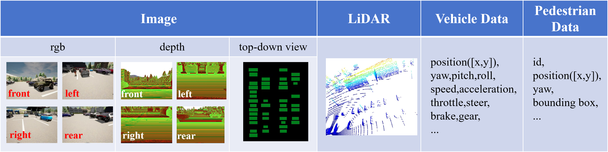

# DynaPark-Ped  
**Pedestrian-Aware End-to-End Autonomous Parking via Coupling-Regulated Multi-Task Learning**

## Overview

Autonomous parking in real-world environments requires handling dynamic obstacles, among which pedestrians pose the highest safety risk due to their unpredictable motion.  
**DynaPark-Ped** proposes an end-to-end pedestrian-aware autonomous parking framework that tightly integrates **pedestrian trajectory prediction** with **imitation learning-based planning** under a **multi-task learning** paradigm.

Our system consists of two sequentially dependent modules:

- **Pedestrian Prediction Module**  
  Takes surround-view camera images as input and predicts future pedestrian bounding boxes, providing explicit visual motion cues.

- **Planning Module**  
  Consumes multi-modal perception features together with predicted pedestrian cues to generate continuous control commands for autonomous parking.

To better coordinate these two tasks, we explore three training paradigms:
1. Separate learning  
2. fully joint learning  
3. **Coupling-regulated joint learning** — introduces cross-task loss coupling to reduce negative interference and improve overall system performance.

This design enables safer and more reliable parking in dynamic, pedestrian-interactive environments.

---

## Parking Demonstrations

### Scenario 1 – Pedestrian Crossing During Parking

  

### Scenario 2 – Complex Pedestrian Interaction

  

---

## DynaPark-Ped Dataset

We introduce **DynaPark-Ped**, a newly collected **ego-centric, multi-modal dynamic parking dataset** built in the **CARLA simulator**, specifically designed for **pedestrian-interactive parking scenarios**.
Each frame contains synchronized perception data, vehicle states, and pedestrian annotations, enabling research on **joint perception, prediction, and planning**.

  

### 1. Surround-View Image Data

The dataset provides **four-view camera images** covering the full surroundings of the ego vehicle:

- **Front view (RGB)**
- **Left view (RGB)**
- **Right view (RGB)**
- **Rear view (RGB)**
