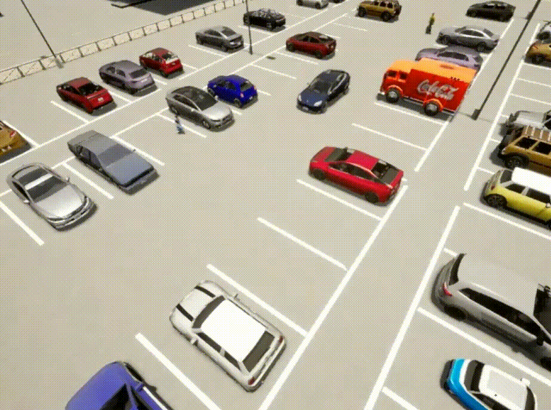

# DynaPark-Ped  
**Pedestrian-Aware End-to-End Autonomous Parking via Coupling-Regulated Multi-Task Learning**

## Overview

Autonomous parking in real-world environments requires handling dynamic obstacles, among which pedestrians pose the highest safety risk due to their unpredictable motion.  
**DynaPark-Ped** proposes an end-to-end pedestrian-aware autonomous parking framework that tightly integrates **pedestrian trajectory prediction** with **imitation learning-based planning** under a **multi-task learning** paradigm.

Our system consists of two sequentially dependent modules:

- **Pedestrian Prediction Module**  
  Takes surround-view camera images as input and predicts future pedestrian bounding boxes, providing explicit visual motion cues.

- **Planning Module**  
  Consumes multi-modal perception features together with predicted pedestrian cues to generate continuous control commands for autonomous parking.

To better coordinate these two tasks, we explore three training paradigms:
1. Separate learning  
2. fully joint learning  
3. **Coupling-regulated joint learning** — introduces cross-task loss coupling to reduce negative interference and improve overall system performance.

This design enables safer and more reliable parking in dynamic, pedestrian-interactive environments.

---

## Parking Demonstrations

### Scenario 1 – pedestrian yields during parking

  

### Scenario 2 – pedestrian continues crossing during parking

  

---

## DynaPark-Ped Dataset

We introduce **DynaPark-Ped**, a newly collected **ego-centric, multi-modal dynamic parking dataset** built in the **CARLA simulator**, specifically designed for **pedestrian-interactive parking scenarios**.
Each frame contains synchronized perception data, vehicle states, and pedestrian annotations, enabling research on **joint perception, prediction, and planning**.

### 1. Surround-View Image Data

The dataset provides **four-view camera images** covering the full surroundings of the ego vehicle:

- **Front view (RGB)**
- **Left view (RGB)**
- **Right view (RGB)**
- **Rear view (RGB)**

In addition to RGB images, we also include:

- **Depth images (per view)**  
  Providing pixel-wise distance information for geometry-aware perception.

- **Top-down occupancy-style view**  
  A bird’s-eye spatial representation describing obstacles and scene layout around the vehicle.

---

### 2. LiDAR Point Cloud

Each timestamp contains a **3D LiDAR point cloud** captured from the ego vehicle.

LiDAR provides:

- Accurate 3D geometric structure of the parking environment  
- Reliable spatial information for static obstacles and surrounding structures  

---

### 3. Ego-Vehicle State and Control Data

We record detailed **vehicle kinematics and control signals**, including:

- Vehicle position: **(x, y)**
- Orientation: **yaw, pitch, roll**
- Motion states: **speed, acceleration**
- Control commands:
  - throttle  
  - steering  
  - brake  
  - gear  

---

### 4. Pedestrian Annotations

To support pedestrian-aware decision making, the dataset provides structured pedestrian information:

- **Pedestrian ID**
- **Position (x, y)**
- **Yaw (heading direction)**
- **2D bounding boxes** in image space
- Temporal consistency for tracking and trajectory modeling

---
### Summary of Modalities

| Modality | Description |
|----------|-------------|
| Multi-view RGB | Front / Left / Right / Rear camera images |
| Depth Images | Per-view geometric depth maps |
| Top-down View | Bird’s-eye occupancy-style representation |
| LiDAR | 3D point cloud of the environment |
| Vehicle Data | Pose, motion states, and control signals |
| Pedestrian Data | IDs, positions, orientations, and bounding boxes |

DynaPark-Ped provides a comprehensive multi-modal benchmark for developing **pedestrian-aware autonomous parking systems** in dynamic environments.
